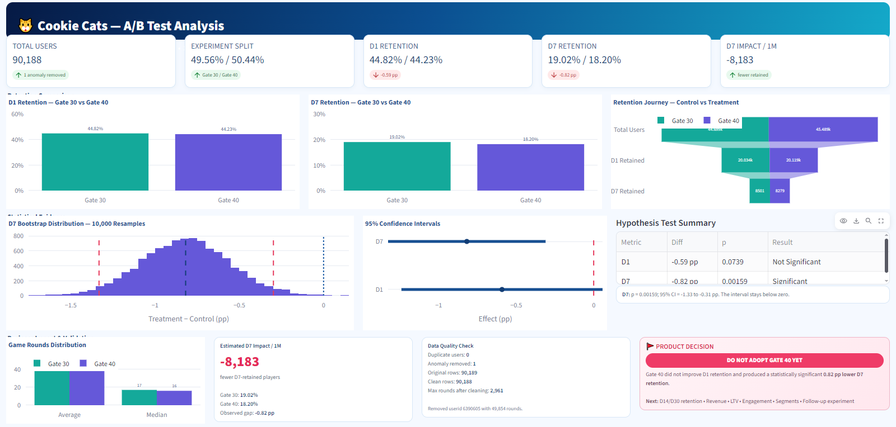

# 🎮 A/B Testing — Mobile Game Retention Experiment

**Python • Pandas • NumPy • SciPy • Statsmodels • Matplotlib • Statistical Testing • Bootstrap**

---

## 📌 Business Problem

A mobile game company wanted to test whether moving the first progression gate from **Level 30 to Level 40** would improve player retention.

The experiment compared:

* **Control:** Gate at Level 30
* **Treatment:** Gate at Level 40
* **Users:** ~90,000

The objective was to determine whether the change affected **Day-1 and Day-7 player retention** and whether the observed effect was large enough to matter at scale.

---

## 🧾 TL;DR

| | |
| --- | --- |
| **Decision** | **Do not adopt Gate 40 yet** |
| **Day-1 retention** | −0.59 pp (p = 0.0739), inconclusive |
| **Day-7 retention** | −0.82 pp (p = 0.00159), statistically significant |
| **Business impact** | ≈ 8,183 fewer Day-7 retained players per 1M users |
| **Next step** | Validate D14/D30 retention, revenue/LTV and engagement in a follow-up experiment |

---

## 🔬 Experiment Design

Players were randomly assigned to one of two experiences:

```text
                Random Assignment
                       │
            ┌──────────┴──────────┐
            │                     │
       Gate 30               Gate 40
       Control               Treatment
       44,699 users           45,489 users
            │                     │
            └──────────┬──────────┘
                       │
                Compare Retention
                   D1 & D7
```

One obvious gameplay anomaly — a player with **49,854 game rounds** (user 6390605) — was removed before the final analysis, leaving 90,188 of the original 90,189 rows.

### Sample Ratio Mismatch (SRM) Check

The groups are close to a 50/50 split (49.56% / 50.44%). To check this formally, a chi-square goodness-of-fit test against an expected 50/50 split gives:

* χ² ≈ 6.92, p ≈ 0.0085

This is a small deviation. It would be flagged under a strict 0.05 threshold but passes the 0.001 threshold commonly used for SRM alerts in experimentation platforms. Given the small gap (about 0.9 pp) and that the data-quality checks found no duplicates or missing values, the split is treated as acceptable, but it is worth monitoring in any follow-up experiment.

---

## A/B Testing Report



---

## 📊 Key Results

| Metric              | Gate 30 | Gate 40 | Difference | p-value |
| ------------------- | ------: | ------: | ---------: | ------: |
| **Day-1 Retention** |  44.82% |  44.23% |   −0.59 pp |  0.0739 |
| **Day-7 Retention** |  19.02% |  18.20% |   −0.82 pp | 0.00159 |

### Day-1 Retention

The Gate 40 group had **0.59 percentage points lower** Day-1 retention.

The result was **not statistically significant** at the 95% confidence level.

**95% CI:** −1.24 pp to +0.06 pp

### Day-7 Retention

The Gate 40 group had **0.82 percentage points lower** Day-7 retention.

The result was statistically significant.

**95% CI:** −1.33 pp to −0.31 pp

### Two Metrics, One Experiment

Because two retention metrics were tested, the risk of a false positive increases slightly. Applying a Bonferroni correction (α = 0.05 / 2 = 0.025):

* **D7** (p = 0.00159) remains significant.
* **D1** (p = 0.0739) remains not significant.

The conclusion does not change. Note that D1 and D7 are measured on the same players, so the two tests are correlated rather than independent.

---

## 🔁 Bootstrap Validation

To validate the uncertainty around the retention differences, the experiment was bootstrapped **10,000 times**.

### D1

**95% Bootstrap CI:** −1.25 pp to +0.05 pp

The interval crosses zero, consistent with the inconclusive D1 result.

### D7

**95% Bootstrap CI:** −1.33 pp to −0.32 pp

The interval remains below zero, supporting the observed negative D7 retention difference.

---

## 🎯 Sensitivity (Minimum Detectable Effect)

With roughly 45,000 players per group, at 95% confidence and 80% power, the test could reliably detect differences of about:

* **D1:** ~0.9 pp
* **D7:** ~0.7 pp

The observed D1 gap (−0.59 pp) is smaller than what this test was powered to detect, which is why D1 is best read as **inconclusive** rather than as evidence of no effect. The observed D7 gap (−0.82 pp) sits just above the D7 detection threshold.

*These are approximate, normal-approximation figures based on the baseline retention rates.*

---

## 💼 Practical Business Impact

The observed D7 retention gap was:

**−0.818 percentage points**

Applied to **1 million players**:

> **≈ 8,183 fewer Day-7 retained players**

This translates the statistical result into a business-scale metric that a product team can understand.

---

## 🧹 Data Quality & Validation

The analysis included:

* Missing-value checks
* Duplicate user checks
* Group-size validation and SRM test
* Gameplay distribution comparison
* Outlier detection
* Anomaly removal
* Post-cleaning balance validation

After removing the extreme observation, the control and treatment groups remained well balanced.

---

## 📈 Analysis Performed

The project covers a complete A/B testing workflow:

1. Business problem definition
2. Experiment design
3. Data quality checks
4. Randomisation/balance validation (including SRM test)
5. Anomaly detection and removal
6. D1 retention analysis
7. D7 retention analysis
8. Hypothesis testing
9. Two-proportion z-tests
10. 95% confidence intervals
11. Multiple-comparison check (Bonferroni)
12. 10,000-iteration bootstrap
13. Bootstrap uncertainty visualization
14. Sensitivity / minimum detectable effect
15. Practical effect calculation
16. Statistical vs practical significance
17. Product limitations
18. PM decision memo

---

## ⚠️ What the Experiment Cannot Tell Us

Retention alone does not provide the complete product picture.

Further analysis is needed for:

* **D14 / D30 retention**
* Revenue and LTV
* In-game purchases
* Advertising revenue
* Player engagement
* Player experience
* Segment-level effects
* Longer-term impact

The experiment may also be affected by short-term or **novelty effects**, so the result should be validated with additional cohorts or experiments.

---

## 🧠 Product Decision

The experiment does **not show an improvement in retention from moving the gate to Level 40**.

The strongest signal is a statistically supported **0.82 percentage-point lower Day-7 retention** for the Gate 40 group.

Before adopting the Level 40 gate as the default, the product team should evaluate longer-term retention, revenue/LTV, engagement, and results from a follow-up experiment.

---

## 📁 Repository Structure

```text
A-B-Testing/
├── AB_testing.ipynb                      # Full analysis notebook
├── cookie_cats.csv                       # Experiment dataset
├── AB_Testing_Mobile_Game_Retention.pdf  # Written A/B test report
├── Product Decision Memo.pdf             # PM-facing recommendation
├── A_B_test_report.png                   # Summary dashboard
└── README.md
```

---

## ▶️ How to Run

```bash
git clone https://github.com/Mohd-Shams/A-B-Testing.git
cd A-B-Testing
pip install pandas numpy scipy statsmodels matplotlib jupyter
jupyter notebook AB_testing.ipynb
```

---

## 🛠️ Tech Stack

* **Python**
* **Pandas**
* **NumPy**
* **SciPy**
* **Statsmodels**
* **Matplotlib**
* **Jupyter Notebook**
* **Statistical Hypothesis Testing**
* **Bootstrap Resampling**

---

## 🎯 Key Takeaway

> **Moving the progression gate from Level 30 to Level 40 did not improve measured retention. While Day-1 retention was inconclusive, Day-7 retention was 0.82 percentage points lower, equivalent to approximately 8,183 fewer retained players per 1 million users.**
